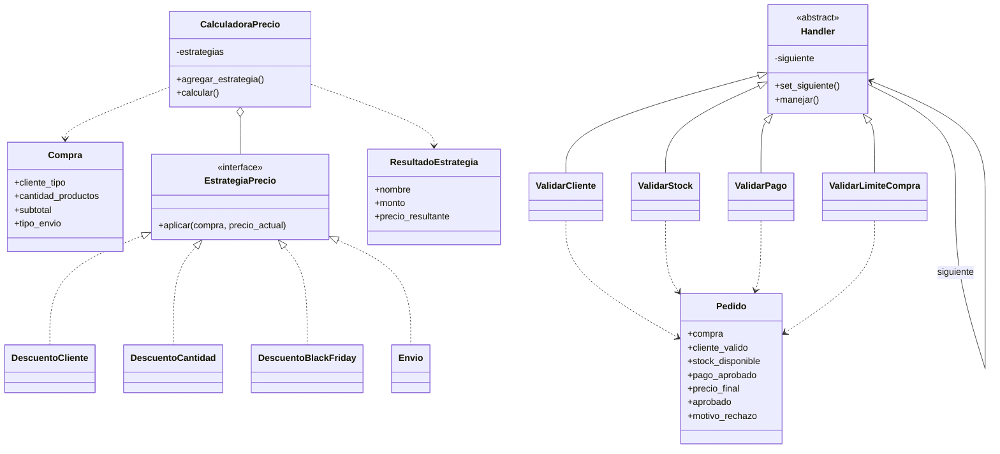

# Trabajo Práctico – Patrones de Diseño
## Strategy + Chain of Responsibility

Implementación en **Python** del sistema solicitado.

## 1. Estructura del proyecto

```text
trabajo_patterns_strategy_chain/
│
├── main.py
├── README.md
│
├── models/
│   ├── __init__.py
│   ├── compra.py
│   └── pedido.py
│
├── strategy/
│   ├── __init__.py
│   ├── estrategia.py
│   ├── resultado.py
│   ├── descuento_cliente.py
│   ├── descuento_cantidad.py
│   ├── descuento_black_friday.py
│   ├── envio.py
│   └── calculadora_precio.py
│
└── chain/
    ├── __init__.py
    ├── handler.py
    ├── validar_cliente.py
    ├── validar_stock.py
    ├── validar_pago.py
    └── validar_limite_compra.py
```

## 2. ¿Cómo ejecutar?

Desde la carpeta raíz:

```bash
python main.py
```

No necesita instalar librerías externas. Utiliza solamente la biblioteca estándar de Python.

---

# PARTE 1 – Strategy

## ¿Qué problema resuelve Strategy?

Strategy permite encapsular cada regla de cálculo en una clase independiente.

En lugar de colocar todos los descuentos y costos de envío dentro de una única clase llena de `if`, cada regla tiene su propia estrategia.

Por ejemplo:

- `DescuentoCliente`
- `DescuentoCantidad`
- `DescuentoBlackFriday`
- `Envio`

La clase `CalculadoraPrecio` no necesita conocer cómo funciona internamente cada regla. Solamente recibe estrategias y las ejecuta.

Esto facilita agregar nuevas reglas sin modificar las estrategias existentes.

## ¿Por qué una compra puede necesitar varias estrategias?

Porque una compra puede cumplir varias condiciones al mismo tiempo.

Por ejemplo:

```text
Cliente VIP       → -15%
Más de 10 items   → -10%
Black Friday      → -10%
Envío Express     → +$10.000
```

Las estrategias se aplican en el orden en el que fueron agregadas a la calculadora.

Los descuentos porcentuales se calculan sobre el precio vigente en ese momento.

Ejemplo:

```text
Precio inicial:          $100.000
VIP -15%:                 $85.000
Cantidad -10%:            $76.500
Black Friday -10%:        $68.850
Envío Express +$10.000:   $78.850
```

---

# Estrategias implementadas

### Cliente común

```text
0%
```

### Cliente Premium

```text
10%
```

### Cliente VIP

```text
15%
```

### Cantidad

```text
Más de 5 productos  → 5%
Más de 10 productos → 10%
```

Se aplica solamente el descuento correspondiente al tramo más alto. Por ejemplo, una compra de 12 productos obtiene 10%, no 5% + 10%.

### Envío

```text
Retiro en sucursal → $0
Envío normal       → +$5.000
Envío express      → +$10.000
```

### Promoción especial

El diseño permite agregar promociones mediante nuevas estrategias.

En este proyecto se implementó el desafío:

```text
DescuentoBlackFriday → -10%
```

---

# PARTE 2 – Chain of Responsibility

## ¿Qué problema resuelve?

Chain of Responsibility permite enviar un pedido por una cadena de validadores.

Cada handler tiene una responsabilidad concreta.

La cadena utilizada es:

```text
Validar Cliente
      ↓
Validar Stock
      ↓
Validar Pago
      ↓
Validar Límite de Compra
      ↓
    Fin
```

Cada validador puede:

1. Aprobar su propia validación y continuar.
2. Rechazar el pedido y detener la cadena.

## ¿Qué sucede cuando un elemento rechaza el pedido?

El handler informa el motivo y no llama al siguiente handler.

Por ejemplo:

```text
Validar Cliente → OK
Validar Stock   → ERROR: stock insuficiente
```

En ese momento el pedido queda rechazado y `Validar Pago` no se ejecuta.

---

# Validadores implementados

## ValidarCliente

Comprueba que el pedido tenga un cliente válido.

## ValidarStock

Comprueba que haya stock suficiente para todos los productos.

## ValidarPago

Comprueba que el pago haya sido aprobado.

## ValidarLimiteCompra

Es parte del desafío.

Comprueba que el importe final no supere el límite establecido.

El límite utilizado en el ejemplo es:

```text
$500.000
```

Si el pedido supera ese importe, se rechaza.

---

# Pedidos solicitados

El programa ejecuta varios casos:

### 1. Pedido aprobado

Cumple todas las validaciones.

### 2. Pedido rechazado por falta de stock

`ValidarStock` rechaza el pedido.

Los handlers posteriores no se ejecutan.

### 3. Pedido rechazado por problema en el pago

Cliente y stock son correctos, pero `ValidarPago` rechaza el pedido.

`ValidarLimiteCompra` no se ejecuta.

### 4. Pedido rechazado por límite de compra

Caso adicional para demostrar el desafío.

---

# DESAFÍO

Se agregaron:

```text
DescuentoBlackFriday
ValidarLimiteCompra
```

Lo importante es que no fue necesario modificar las estrategias o validadores anteriores.

Para agregar el descuento se creó:

```text
strategy/descuento_black_friday.py
```

y se agregó esa instancia a la lista de estrategias desde `main.py`.

Para agregar el nuevo validador se creó:

```text
chain/validar_limite_compra.py
```

y se incorporó a la cadena desde `main.py`.

Esto demuestra la extensibilidad de ambos patrones.

---

# Diagrama de clases



---

# Relación entre los dos patrones

Los patrones resuelven problemas diferentes dentro del mismo proceso.

```text
                    COMPRA
                       │
                       ▼
              ┌─────────────────┐
              │     STRATEGY    │
              └─────────────────┘
                       │
                       │ calcula precio
                       ▼
                 Precio final
                       │
                       ▼
              ┌─────────────────┐
              │      CHAIN      │
              └─────────────────┘
                       │
        ┌──────────────┼──────────────┐
        ▼              ▼              ▼
     Cliente         Stock           Pago
        │              │              │
        └──────────────┴──────────────┘
                       │
                       ▼
                Límite de compra
                       │
                       ▼
                 Pedido aprobado
```

**Strategy** decide cómo calcular el precio.

**Chain of Responsibility** decide si el pedido puede continuar hasta ser confirmado.

---

# Salida esperada

Al ejecutar:

```bash
python main.py
```

se muestran las estrategias utilizadas, el precio después de cada estrategia y los pasos de cada validación.

Un ejemplo de salida es:

```text
============================================================
PEDIDO 1 - APROBADO
============================================================

--- Cálculo del precio ---
Precio inicial: $100000.00
[Strategy] Descuento cliente VIP: -$15000.00 → $85000.00
[Strategy] Descuento por cantidad: -$8500.00 → $76500.00
[Strategy] Black Friday: -$7650.00 → $68850.00
[Strategy] Envío Express: +$10000.00 → $78850.00

Precio final: $78850.00

--- Cadena de validación ---
[Chain] Validar Cliente → OK
[Chain] Validar Stock → OK
[Chain] Validar Pago → OK
[Chain] Validar Límite de Compra → OK

RESULTADO: PEDIDO APROBADO
```

Los otros pedidos muestran dónde se detiene la cadena cuando aparece un error.
